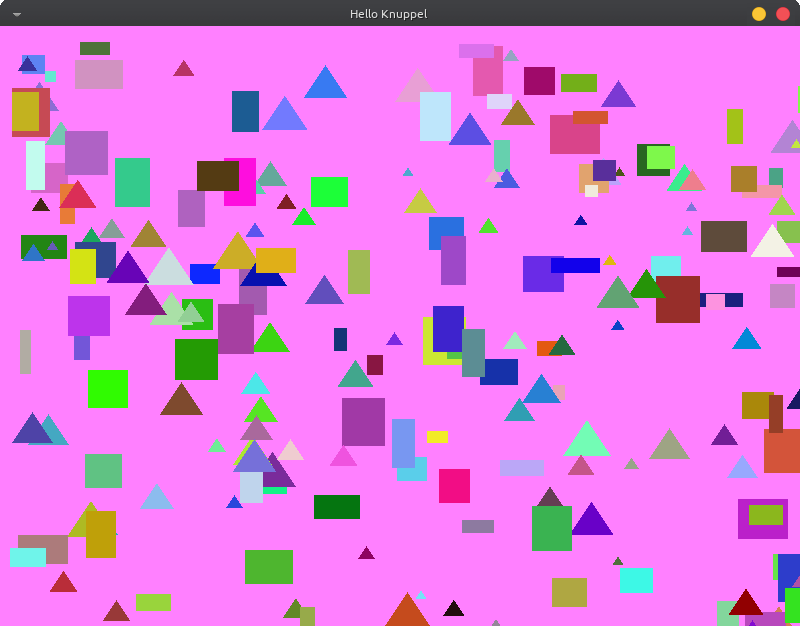
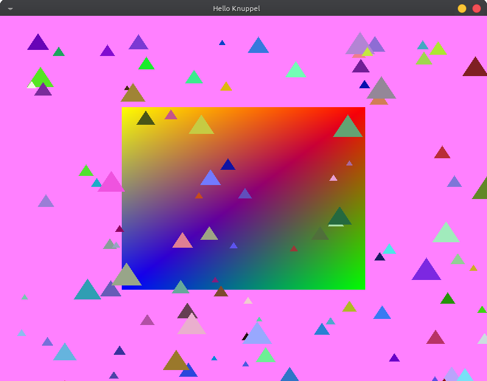

# Knuppel 🦇
# About
**Knuppel** is a very simple and basic framework I am developing to code some games

Using `SDL2` and `Glad` I aim to create a very simple to use framework to supply my needs




# Current Stage
**Knuppel** is in very early stages, check `src/main.cpp`

# Objectives
- [X] Window creation
- [X] Events
    + Not all, but I can add more if I need
- [X] 2D shapes
    + [X] Draw
    + [X] Colors
    + [X] Position
    + [X] Texture
- [ ] 3D shapes
    + [ ] Draw
    + [ ] Colors
    + [ ] Position
    + [ ] Texture
- [ ] Audio
- [ ] Gif texture?

# Running
## Dependencies
- [`SDL2`](https://www.libsdl.org/) With [`SDL2 Image`](https://wiki.libsdl.org/SDL2_image/FrontPage)
- [`GLEW`](https://glew.sourceforge.net/)

*(If you are on Linux is probably all avaiable on your package manager)*,

## Compiling
- If you want to compile as a `lib` file and use in any project, you will need `Make`
- If you just want to test and use `main.cpp` *(inside `src/`)*, you will need `CMake`

## CMake
```sh
cmake -S . -B build # Config
cmake --build build # Compile
./build/knuppel     # Run
```

## Make
```sh
make
```
This will create a `lib/` folder, inside it you should have a file called `libknuppel.so`, if you want to use this file,
 locally, you can move to your project directory and link to your program

**WARNING:** Local link doesn't seem to work well, so follow the next section to have a global link of the lib

## Linking to your program
<!-- ### Locally -->
<!-- Move `include` folder to your project -->
<!---->
<!-- Let's say you have a file called `main.cpp` importing **Knuppel**, you should include with `""`: -->
<!-- ```cpp -->
<!-- #include "include/Knuppel/window/window.hpp" -->
<!-- ``` -->
<!---->
<!-- To run the program with `Knuppel` linked, you should run the following command: -->
<!-- ```sh -->
<!-- clang++ main.cpp -lSDL2 -lSDL2_image -lGL -lGLEW -L. -lknuppel -o game -->
<!-- ``` -->

<!-- ### Globally -->
<!-- Alternativally, to not have to use `-L.` flag, you can move `libknuppel.so` to `/usr/lib` and **Knuppel**'s include folder to `/usr/include`, -->
<!--  this way you don't need to move `libknuppel.so` to every project you want to use it -->

Move some files
```
sudo cp libknuppel.so /usr/lib/
sudo cp -r include/ /usr/include/Knuppel
```

Then you can include properly
```cpp
#include <Knuppel/window/window.hpp>
```

And now you can run
```sh
clang++ main.cpp -lGL -lGLEW -lSDL2 -lSDL2_image -lknuppel -o game
```

# Credits
Made by me 🦇

**Libraries used:** [`SDL2`](https://www.libsdl.org/) for graphics and input handling, and [`Glad`](https://glad.dav1d.de/) for OpenGL

